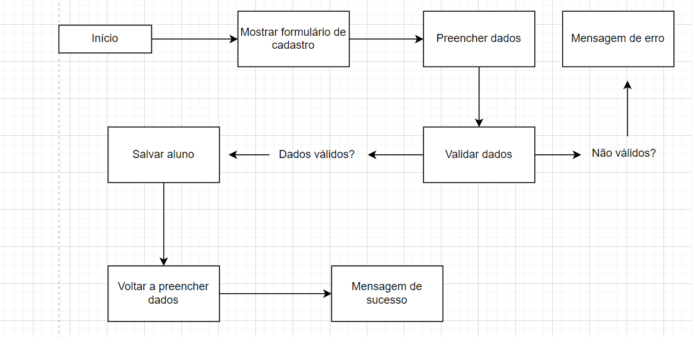
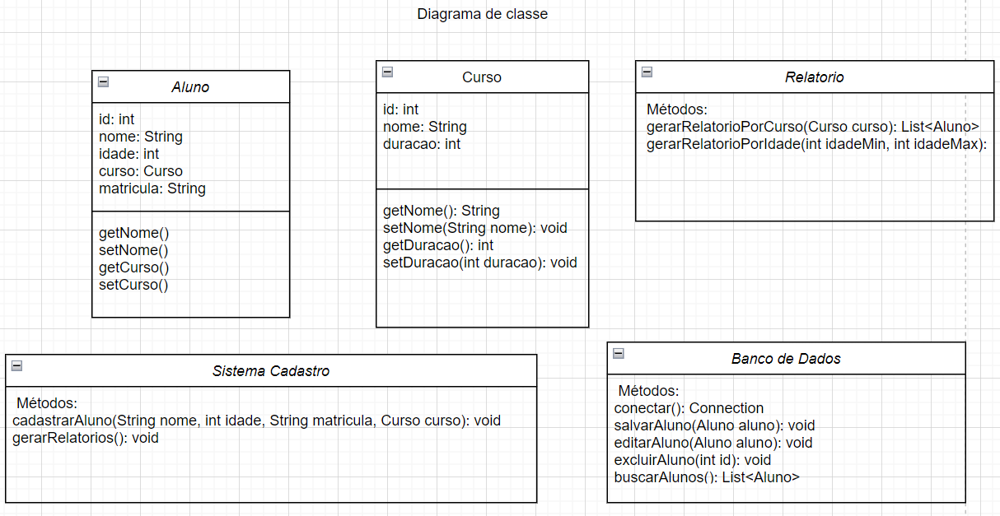

# Sistema de Cadastro de Alunos

## Contexto do Projeto
O Sistema de Cadastro de Alunos é uma aplicação voltada para a gestão eficiente de informações de alunos em instituições de ensino. O projeto visa facilitar o cadastro, gerenciamento e consulta de dados dos alunos, permitindo que administradores e professores realizem operações de forma rápida e intuitiva. Utilizaremos Java com a biblioteca Swing para a interface gráfica e PostgreSQL para a persistência de dados.

## Escopo do Projeto
Desenvolver um sistema de cadastro de alunos que permita o gerenciamento das informações dos alunos, incluindo funcionalidades para registro, edição, exclusão e consulta de dados. O sistema terá uma interface amigável e será projetado para atender as necessidades tanto de administradores quanto de professores, garantindo eficiência e organização.

## Objetivos Gerais
- Criar uma aplicação que permita o cadastro e gerenciamento de informações de alunos.
- Integrar tecnologias que garantam a performance e a segurança da aplicação.
- Proporcionar uma interface de usuário intuitiva e acessível.

## Objetivos Específicos
- Implementar um sistema de cadastro de alunos com informações como nome, idade, curso e matrícula.
- Permitir que administradores e professores acessem e atualizem os dados dos alunos.
- Oferecer relatórios de desempenho e status dos alunos.
- Garantir a segurança das informações por meio de autenticação.

## Objetivos Mensuráveis
- **Meta de Usuários**: Alcançar 500 alunos cadastrados no sistema nos primeiros 3 meses.
- **Meta de Funcionalidade**: Implementar todas as funcionalidades principais no prazo de 4 meses.
- **Taxa de Erros**: Garantir que a taxa de erros do sistema não ultrapasse 2% durante os testes.

## Objetivos Atingíveis
- Utilizar tecnologias de fácil integração e suporte, como Java e PostgreSQL.
- Aplicar metodologias ágeis para facilitar a implementação e o desenvolvimento contínuo.
- Focar em uma interface de usuário simples, com treinamento mínimo para novos usuários.

## Objetivos Relevantes
- Oferecer uma solução que atenda às demandas atuais de instituições de ensino em relação ao gerenciamento de dados.
- Melhorar a eficiência no cadastro e consulta de alunos, facilitando o trabalho de administradores e professores.
- Proporcionar um sistema seguro e confiável para a gestão de informações sensíveis.

## Objetivos Temporais
### Fase 1:
- Definição do escopo detalhado e levantamento de requisitos.
- Criação do banco de dados no PostgreSQL.
- Desenvolvimento inicial do backend e configuração do ambiente.

### Fase 2:
- Implementação das principais funcionalidades: cadastro, edição e exclusão de alunos.
- Criação da interface gráfica utilizando Swing.
- Início dos testes unitários.

### Fase 3:
- Implementação de funcionalidades de relatórios e consultas.
- Testes finais e ajustes baseados no feedback.
- Preparação para a entrega final e documentação do sistema.

## Análise de Riscos
### Problemas Potenciais e Soluções
1. **Baixa Adoção Inicial**
   - **Impacto**: Dificuldade em atrair usuários para o sistema.
   - **Soluções**: Campanhas de divulgação e treinamento para usuários.

2. **Sobrecarga do Banco de Dados**
   - **Impacto**: Possíveis lentidões no sistema com o aumento de dados.
   - **Soluções**: Otimização de consultas e uso de índices.

3. **Vulnerabilidades de Segurança**
   - **Impacto**: Risco de acesso não autorizado aos dados dos alunos.
   - **Soluções**: Implementação de autenticação robusta e criptografia de dados sensíveis.

4. **Bugs e Problemas Técnicos**
   - **Impacto**: Erros que podem comprometer a experiência do usuário.
   - **Soluções**: Adoção de testes rigorosos e feedback constante dos usuários.

## Recursos Tecnológicos
- **Linguagem de Programação**: Java
- **Biblioteca de Interface Gráfica**: Swing
- **Banco de Dados**: PostgreSQL
- **Ambiente de Desenvolvimento**: Visual Studio Code
- **Ferramentas de Controle de Versão**: Git

## Recursos Humanos
- **Desenvolvedor Backend**: Responsável pela lógica de negócio e integração com o banco de dados.
- **Desenvolvedor Frontend**: Responsável pela criação da interface gráfica e experiência do usuário.
- **Analista de Sistemas**: Responsável pela coleta de requisitos e definição do escopo.
- **Tester**: Responsável por realizar testes e garantir a qualidade do sistema.
- **Gerente de Projeto**: Responsável pela coordenação da equipe e cumprimento dos prazos.

**Diagrama de Fluxo**

**Diagrama de Uso**

**Diagrama de Classes**

# Manual do Usuário

Este manual descreve o fluxo de trabalho e as principais funcionalidades do **Sistema de Gerenciamento de Alunos**.

## Índice
1. [Instalação](#instalação)
2. [Início Rápido](#início-rápido)
3. [Funcionalidades do Sistema](#funcionalidades-do-sistema)
    - [1. Cadastro de Alunos](#cadastro-de-alunos)
    - [2. Listar Alunos](#listar-alunos)
    - [3. Buscar Aluno por Matrícula](#buscar-aluno-por-matrícula)
    - [4. Inserir Notas (Professor)](#inserir-notas-professor)
    - [5. Gerar Boletim](#gerar-boletim)
    - [6. Gerar Relatórios](#gerar-relatórios)
4. [Fluxo Básico de Uso](#fluxo-básico-de-uso)

---

## Instalação

### Requisitos
- **Java**: Certifique-se de que você tem o JDK 8 ou superior instalado em sua máquina.
- **Banco de Dados**: O sistema usa PostgreSQL. Certifique-se de que o servidor esteja em execução e que a base de dados esteja configurada corretamente.

. Certifique-se de configurar a conexão com o banco de dados PostgreSQL no arquivo de configuração, incluindo usuário, senha, e nome do banco de dados.

## Início Rápido

### Tela de Login
1. **Login de Administrador**: Acesse todas as funcionalidades do sistema, incluindo o cadastro e remoção de alunos, além de gerar relatórios.
2. **Login de Professor**: Permite a consulta de alunos, inserção de notas e geração de boletins.

---

## Funcionalidades do Sistema

### 1. Cadastro de Alunos (Administrador)
- **Descrição**: O administrador pode cadastrar novos alunos inserindo as informações necessárias, como nome, idade, curso e matrícula.
- **Como usar**:
    - Acesse a tela de cadastro.
    - Preencha os campos obrigatórios.
    - Clique no botão "Cadastrar Aluno".

### 2. Listar Alunos
- **Descrição**: Professores e administradores podem visualizar a lista completa de alunos cadastrados no sistema.
- **Como usar**:
    - Na tela principal, clique em "Listar Alunos".
    - A lista de alunos será exibida.

### 3. Buscar Aluno por Matrícula
- **Descrição**: O sistema permite a busca de alunos por número de matrícula.
- **Como usar**:
    - Insira a matrícula do aluno no campo de busca.
    - Clique em "Buscar" para visualizar as informações do aluno.

### 4. Inserir Notas (Professor)
- **Descrição**: O professor pode inserir as notas das provas dos alunos diretamente no sistema.
- **Como usar**:
    - Selecione o aluno desejado por meio da matrícula.
    - Digite as notas para a **Prova 1** e **Prova 2**.
    - Clique em "Salvar Notas".

### 5. Gerar Boletim
- **Descrição**: O professor pode gerar um boletim com as notas das provas dos alunos.
- **Como usar**:
    - Acesse a opção "Gerar Boletim" na tela do professor.
    - Insira a matrícula do aluno.
    - O boletim será exibido com as notas inseridas.

### 6. Gerar Relatórios (Administrador)
- **Descrição**: O administrador pode gerar relatórios com os dados de todos os alunos cadastrados no sistema.
- **Como usar**:
    - Acesse a opção "Gerar Relatório".
    - Insira o caminho do arquivo onde o relatório será salvo.
    - O relatório será gerado no formato especificado.

---

## Fluxo Básico de Uso

1. **Login no Sistema**: O usuário faz login no sistema utilizando as credenciais de administrador ou professor.
2. **Acesso às Funcionalidades**:
   - **Administrador**: Acesso a todas as funcionalidades, como cadastro, listagem de alunos, e geração de relatórios.
   - **Professor**: Acesso à listagem de alunos, inserção de notas e geração de boletins.
3. **Cadastro de Alunos (Administrador)**: O administrador cadastra novos alunos e mantém o sistema atualizado com as informações dos estudantes.
4. **Inserção de Notas (Professor)**: O professor insere as notas dos alunos, garantindo que os boletins estejam sempre atualizados.
5. **Geração de Relatórios**: O administrador pode gerar relatórios com base nos dados cadastrados no sistema, como histórico de alunos e suas notas.

---

